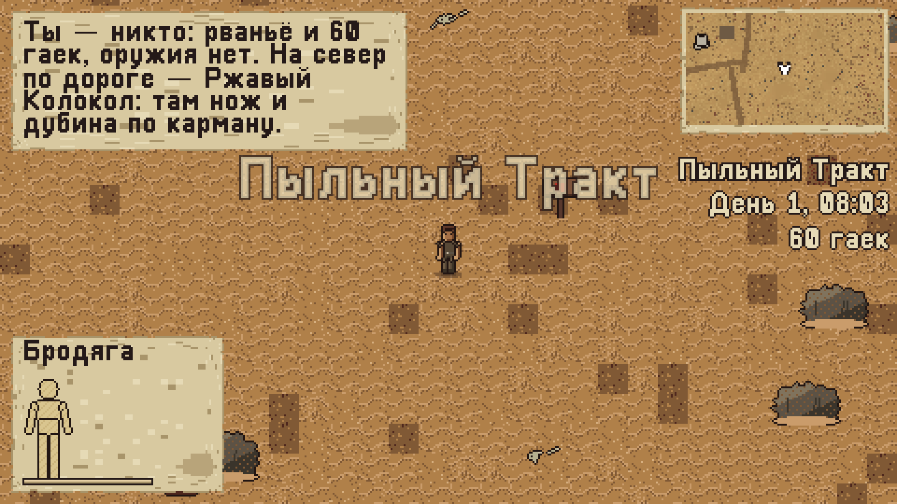
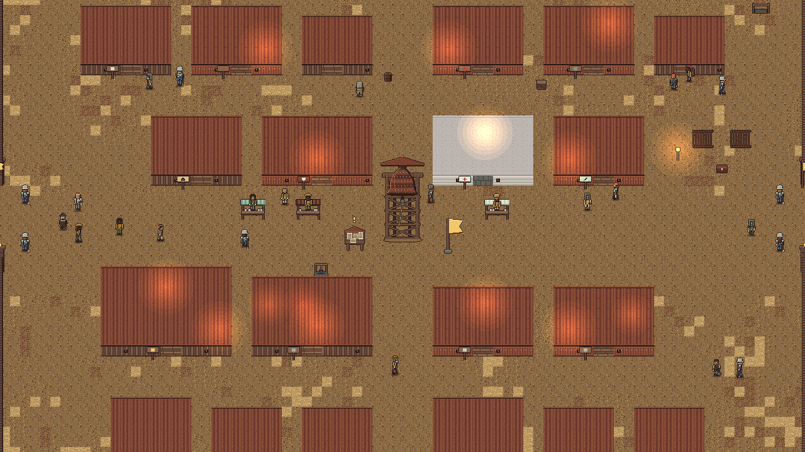
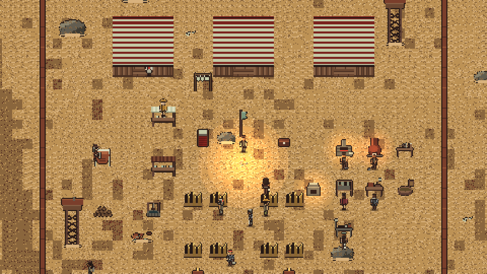
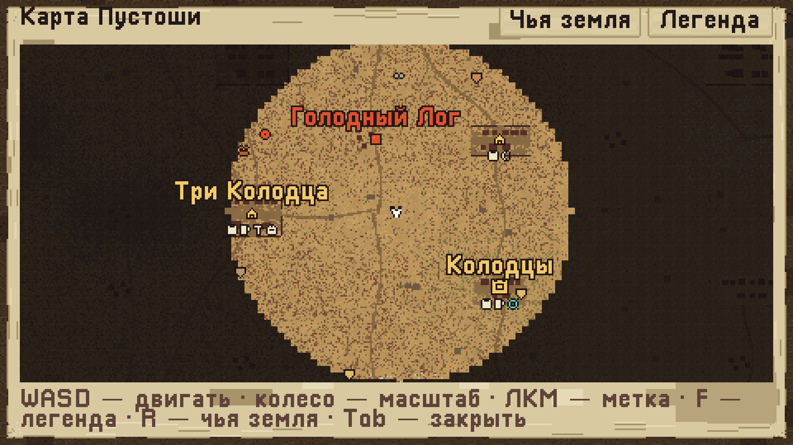

# Ржавая Пустошь — тестовые сборки

Песочница-RPG с видом сверху в духе Kenshi: 2D, пиксель-арт. Ты — никто: рваньё и шестьдесят гаек.
Пустошь живёт своей жизнью — фракции, банды, караваны и города воюют и торгуют без тебя.

**Скачать:** раздел [Releases](../../releases) — архивы для Windows, macOS и приставок через PortMaster.

Сборки тестовые и не подписаны; как запустить на каждой системе — ниже. На настоящей приставке
сборка PortMaster ещё не проверялась.






## Запуск, управление, что нового

```
РЖАВАЯ ПУСТОШЬ — тестовая сборка 0.29.3

Песочница в духе Kenshi. Ты — никто: рваньё и шестьдесят гаек, без оружия. Колоссы Древних
лежат в песке, Пустошь живёт своей жизнью — банды, караваны, звери и города воюют и
торгуют без тебя. Как в ней выжить и кем стать — решаешь сам.

ЗАПУСК
- Windows 10/11: распакуй архив и запусти RustWastes.exe.
  Сборка не подписана. Если Windows скажет «Система Windows защитила ваш компьютер»,
  нажми «Подробнее» → «Выполнить в любом случае».
- macOS (Intel и Apple Silicon): распакуй архив и запусти «Ржавая Пустошь». Сборка не
  подписана Apple, поэтому в первый раз macOS её не пустит:
    • macOS 14 и старше — правый клик по приложению → «Открыть» → «Открыть»;
    • macOS 15 — попробуй открыть, затем «Системные настройки» → «Конфиденциальность и
      безопасность» → внизу «Всё равно открыть».
  Если macOS пишет, что приложение «повреждено», выполни в Терминале (путь — где лежит
  приложение) и запусти снова:
      xattr -cr "/Users/имя/Downloads/Ржавая Пустошь.app"
- Приставки (Anbernic и другие) через PortMaster: архив …-PortMaster.zip распакуй в папку
  ports на карте памяти — появится «Rust Wastes». Игра сама включит полный экран, режим
  «приставка» (подписи кнопками геймпада) и экономный режим. Выход — Select + Start.
  На настоящей приставке сборка ещё не проверялась: если что-то не так — файл
  ports/rustwastes/log.txt расскажет, что именно.
  Замер на железе (с 0.27.0): запусти игру, начни или продолжи любую игру, Настройки → «Замер на
  железе (6 минут)». Игра сама пройдёт шесть сцен (город ночью, бой 20 на 20, буря, подземелье,
  город на ступенях качества 3 и 5), герой будет стоять, ввод заперт, Esc — прервать. В конце
  появятся два файла — bench_card.txt и perf_log.txt: на приставке в ports/rustwastes/, на
  компьютере в папке данных игры (путь игра покажет). Пришли оба.
  Если хочешь поиграть обычно: Настройки → «Нагрузка на экране и лог в файл» — в углу экрана
  строка (кадры, память), а раз в 2 секунды в perf_log.txt пишется лог.

НОВАЯ ИГРА
  «Обучение» — первые шаги по порядку (поселение, оружие, добыча, торговля, бой).
  «Кампания» — «Тринадцатый», 25 глав: цели, счётчики и награды — в журнале заданий и на экране.
  «Свободная игра» — без наставлений. Мир во всех режимах один и тот же.
  Сохранения прошлых сборок не подходят: мир стал другим.

УПРАВЛЕНИЕ (клавиатура и мышь · геймпад)
  WASD / стрелки — идти · крестовина или стик
  J / левая кнопка мыши — удар · X          K / правая кнопка — блок · R1
  Пробел — рывок · B                         E — действие · A
  I — вещи · Y        C — персонаж · Select        L — журнал заданий
  Tab / M — карта · L1 (колесо или L2/R2 — масштаб, F или Y — легенда, щелчок или A — метка)
  Q — приказ отряду · R2        G — сдаться · L2        Esc — закрыть окно, меню · Start (B — назад)
  H — сесть на зверя, слезть, свистнуть · L3        Ctrl / V — красться · R3
  В окнах с вещами: левая кнопка — взять вещь в руку, ещё раз — положить (в клетку, в слот, в
  другую сетку, за окно — выбросить); правая кнопка или A — быстрое действие (надеть, съесть,
  взять, купить); Shift — часть стопки; под курсором — подсказка с цифрами.
  [ ] или L1/R1 — вкладки. Чем играть (авто, ПК, приставка), целые пиксели и экономный
  режим — в «Настройках».

ЧТО НОВОГО В 0.29.3
- Итог моделирования 0.29 (3 круга, 10 стилей по 30 игровых дней, ошибок движка 0, нарушений ревизора мира 0):
  найден и исправлен один настоящий дефект (клетка держала умершего пленника, 0.29.2).
- Настроение спутников в обычной игре держится ровным (за 14 игровых дней отряд из четырёх ни разу
  не доходил до ворчания); срывы возможны, но редки. Значения не менялись: нужен плейтест человека.
- Отчёты симуляции считают часы отряда по полосам настроения верно (раньше терялись малые шаги).

ЧТО НОВОГО В 0.29.2
- Дружба с главами городов: разговор раз в сутки, подарки по вкусам (подсказки о вкусах — в слухах
  и репликах), до 10 сердец. Награды: 2 — скидка у торговцев города, 4 — бесплатная койка,
  6 — личный слух, 8 — личное поручение, 10 — дар друга. Подарить вещь — в меню действий главы.
- Исправлено: если герой умирал пленником в клетке, клетка продолжала держать его и после
  возрождения, возвращая на то же место каждый кадр. Теперь клетка отпускает умершего.
- Симуляция: сторож простоя, отчёты показывают часы отряда по полосам настроения.

ЧТО НОВОГО В 0.29.1
- Описания черт спутников теперь совпадают с тем, что они делают (трус, одиночка, горячая голова).
- Отчёты симуляции показывают настроение отряда: срывы, уходы, подвиги, остались ли за деньги.
- Круг 1 моделирования (10 стилей по 30 дней): ошибок движка 0, нарушений ревизора мира 0.

ЧТО НОВОГО В 0.29.0 («Люди»)
- У спутников есть настроение. Шкала тянется к цели, а не прыгает: еда, койка, костёр, богатая
  добыча, победы поднимают; голод, земля вместо койки, ранения и гибель друга опускают.
  В карточке отряда (Мир → Отряд) — шкала и две-три причины. Ворчит — медленнее исполняет
  приказы; на пределе — срывается; на грани ухода — просит герою остаться (уговорить деньгами,
  попросить или отпустить). Подъём — навыки растут быстрее. На «Лёгкой» срывов и уходов нет.
- Прошлое и черты: у каждого спутника своё прошлое (беглый раб, дезертир стражи, старьёвщик,
  бывший Искатель…) и одна-две черты (храбрый, трус, жадный, суеверный…). Они меняют рост навыков,
  настроение и то, что спутник говорит вслух. Видны в найме и в карточке отряда.
- Срыв или подвиг в бою: на пределе спутник либо совершает подвиг (клич лечит соседей), либо
  паникует, звереет или каменеет на несколько секунд. Не чаще раза в несколько минут на отряд.
- Разговоры с выбором: у именных людей и вольных героев — короткие деревья с вариантами,
  проверкой навыка (честной, без случайности) и последствиями: слух, плата, поручение, отношение,
  вербовка. Десять деревьев. Окно закрывается по Esc, мир не встаёт на паузу.
- Реплики спутников теперь зависят от настроения, черты и недавних событий.

ЧТО НОВОГО В 0.28.0 («Свет и цвет»)
- Цветокоррекция мира: тени холодеют, света теплеют — по часам (рассвет, день, закат, ночь) и
  по непогоде (соль, пыль, кислота, испарения, луч, дождь, стылый ветер). Интерфейс не красится.
- Тени на земле у построек, предметов и обломков колоссов; солнце жёсткое, сверху-слева, тени
  длиннее к утру и вечеру и пропадают ночью и в бурю.
- Свет фонарей и костров ступенями с дизерингом, мерцание шагом; свечение Древних пульсирует,
  вокруг них плывут бирюзовые споры; у костров — угли и дым; под ногами героя — пыль по земле.
- Колоссы в кадре: по краям экрана проступают рёбра, колени, черепа, позвоночники и кабели
  мегаструктур с параллаксом (у краёв мира — череп и колено).
- Земля без квадратов: пятна другого грунта, перетекание земель и дороги — органичные кромки.
- Погода глазами: дождь и кислота — струями, пыль, снег стылого ветра, испарения, искры луча;
  двойная пелена, молния в дождь, марево в жар луча, спад видимости к краям кадра в бурю.
- Кровь держится тысячами пятен (раньше — 250 на весь мир).
- Всё это тянет ступень качества «авто»: на слабом железе сначала уходят частицы, потом свет,
  тени и цветокоррекция.

ЧТО НОВОГО В 0.27.0 («Крепкий фундамент»)
- Сохранения надёжнее: слот пишется во временный файл, проверяется и только потом встаёт на место;
  прежняя копия (.bak) лежит рядом и подхватывается сама, если слот оборвался. В окне «Загрузить»
  у каждого слота — маленький снимок экрана.
- Чёрный ящик: любая ошибка игры оставляет файл-отчёт в папке reports (на приставке — рядом с игрой);
  в паузе появилась «Сообщить о проблеме» — она пишет такой же отчёт, пришли этот файл.
- «Выпутаться» в паузе: герой и спутники, севшие в стену или щель, переносятся на ближайшее
  свободное место. Жители и звери, застрявшие по дороге, выпутываются сами.
- Ступени качества (Настройки → «Качество»): в «авто» игра спускается по ступеням, когда железо не
  тянет (частицы → свет и тени → разум дальних → ровные 30 кадров), и поднимается обратно; можно
  закрепить ступень. Вместо «Экономного режима».
- Значки состояний под часами: рана, голод, яд, перегруз, хромота, «тебя видят», розыск — три
  ступени тяжести (тон и форма рамки); подсказка при наведении; «только тяжёлые» — в настройках.
- Поручения тянут в неисследованное; доску можно перебросить за очко отношения; пал заказчик —
  дело берёт преемник, а если города не стало — закрывается без штрафа.
- Настройки: «Вспышки и мерцание в бою», «Метки для дальтоников» (цвета отметок карты), «Сбросить
  настройки». Опыт: «Шаг физики» 30 Гц.
- Замер на железе — см. раздел «Приставки» выше.

ЧТО НОВОГО В 0.26.5
- Продажа, покупка, крафт и разбор сериями больше не сыплют всплывашками: пока открыто окно,
  вести копятся тихо, а после закрытия в углу под миникартой одна строка на дело
  («Продано: Нож ×5, Лом, Ремень и ещё 2»).
- В меню новой игры у «Кампании» верное описание: 25 глав по пяти делам.

ЧТО НОВОГО В 0.26.4
- В главном меню внизу теперь настоящая версия сборки (раньше там навсегда застряло «v0.10.0»).

ЧТО НОВОГО В 0.26.3
- Настройки → «Нагрузка на экране и лог в файл»: в углу — кадры, счёт кадра и память, а раз в
  2 секунды в файл perf_log.txt пишется лог (кадры, худший кадр, рывки, бойцы, зона, память).
  Приставка — ports/rustwastes/perf_log.txt, компьютер — папка данных игры (путь игра
  покажет при включении). Нужен для замеров на слабом железе.

ЧТО НОВОГО В 0.26.2
- Метка главы на карте больше не выдаёт неизвестные места: приметное место появляется после
  слуха о нём или когда ты его увидел, руина — когда она отмечена на карте, логово чудовища —
  когда о нём рассказали или оно на открытой карте.
- Новый слух у жителей: про логово мирового чудовища (земля и имя). Он записывается в журнал
  слухов и сохраняется.

ЧТО НОВОГО В 0.26.1 — «Тринадцатый»
- Новая кампания «Тринадцатый»: 25 глав вместо девяти. Она ведёт по пяти делам — воин,
  завоеватель, исследователь, вор, торговец — и кончается под Сорокалетним Холмом.
  Воин: оружие, поручения, навыки и броня, первый спутник, шайки и логова.
  Завоеватель: знамя, лагерь, люди и договор о караванах, город, вес знамени.
  Исследователь: слухи и факты о Древних, приметные места, руины и первый сейф, чудовище,
  присяга державе или гильдии.
  Вор: «Взлом» и «Скрытность», замки и ловушки Древних, протез, дорога к холму (запись сна
  или сны у Шёпот-камня).
  Торговец: выручка, свой караван, снаряжение и полный отряд.
  Финал: шлюз холма, «Немой» или оберег тишины, Пастырь — и судьба ядра, какую выберешь.
  Главы не ведут за руку: говорят, чему учиться и где искать; метка на карте показывает
  ближайшее подходящее место.
- Старое сохранение кампании продолжится с той же по счёту главы нового списка.
- Логово: раны Пастыря не затягиваются, пока ты отлёживаешься уровнем выше; ткачи чинят его
  медленнее; спутники обходят ловушки, которые ты видишь.
- Исправлено: третье падение подряд убивало и тогда, когда зверь или машина давно не били.

ЧТО НОВОГО В 0.26.0 — «Под землёй»
- Руины стали настоящими подземельями. Наверху — остатки отсека и пролом; внизу — свой ярус
  из 3–6 комнат в темноте: запертые переборки (взлом или сила), три вида ловушек (луч жжёт
  ноги, пар обжигает и душит, плита свода падает на голову — её замечает внимательный:
  помогают «Скрытность» и ходьба крадучись; спутники обходят ловушки, которые ты видишь), дроны, терминалы, ящики и сейф в последнем зале.
  На карте мира ты при этом остаёшься у входа. Люк в первой комнате ведёт наверх.
- Логово под Сорокалетним Холмом — пять уровней: Шлюз, Ходовые (стражи хода в броне), Зал
  тех, кто был до тебя (чертёж «Немого» и их последняя запись), Жилы, Узел. Сборщики
  утаскивают упавших уровнем ниже. Спутник с протезом или вживлением под холмом может на
  минуту обернуться против тебя — «Немой» или оберег при тебе это глушат.
- Пастырь получил свой облик: ядро в оплётке и четыре руки. Руки отсекаются — каждая
  ослабляет его, падает трофеем, и из неё на верстаке протезиста собирают «Длань Пастыря».
- Среди «пустых» на нижних уровнях стоят именные герои, которых позвала сеть: герой с
  протезом может однажды бросить всё и уйти на юго-восток. Их можно узнать.
- Третий путь под холм: Пустые Кукловодов раз в несколько дней идут «домой». Проводишь их
  до холма — шлюз останется открыт.
- Разбил ядро — Орден раскалывается всерьёз: часть его городов уходит к Отлучённым,
  паладины больше не ходят в походы.
- Тревога в городе доведена: на ночь ворота закрывают решётками, лавки заперты, стража не
  спит и ходит парами.
- Слухи — отдельный раздел «Мир → Слухи». Своим (отношение от 30), а также тому, кого ты
  накормил или кому подал, рассказывают даром.
- Набор исследователя: шляпа, куртка, сапоги — защищают и не тянут к земле (бег +5%, ноша
  +6 кг; все три — урон −8%, пыль и соль не ранят). Шляпа и сапоги — у снаряжателя, куртка —
  у портного, на полке Искателей или своими руками на верстаке бронника.
- У всех вещей наборов и редких протезов теперь свой вид на теле; щит виден со спины и сбоку.
- Отряд — карточками в «Мир → Отряд»: здоровье, снаряжение, роль кнопкой, приказ и строй.
- Дорога: место в попутном караване (говори с караванщиком); верхом по дороге на четверть
  быстрее; указатели на стоянках называют три ближних поселения и часы пути; три переправы
  (Ржавая Пристань — Клешня, Сваи — Маяк, Ограда — Отмель Лодок); обозы между своими местами.
- Яд: клыки костогрызов, клинки Змея и газ Топи травят — жжёт грудь и душит. Лечит
  противоядие. Ещё в лавках: тряпка и сонный отвар (сон там, где стоишь).
- Ростовщик даёт под залог (вещь дороже займа или своё место) — под 10% вместо 20%. После
  срока приходит гонец; через три дня залог продают. Служишь державе — койка в её городах
  даром, в казарме кормят.
- Каторга — двор за частоколом с одними воротами: четыре вышки, надсмотрщики, псы, барак.
  Кроме соляных копей — два рудника в Кузнечных Долинах.
- Узелки на земле переживают сохранение.

ЧТО НОВОГО В 0.25.0 — «Колоссы»
- Руины Колоссов: 18 мест в диких землях — грудные отсеки, шахты буров и пять головных
  отсеков. Внутри дроны (сборщики — быстрые, ткачи — бирюзовые), излучатели в полу (жгут
  ноги; мигают перед ударом; обезвреживаются «Взломом» 15) и запертый сейф в конце. Подошёл —
  руина на карте. Искатели со второго ранга продают карту ближайшей руины (200 гаек).
- Головной отсек стережёт Страж отсека. В его сейфе — «странная запись, часть N из ?».
  Что в ней написано, читай в «Мир → Древние». Игра не говорит, зачем они нужны.
- Сорокалетний Холм. У подножия — шлюз. Открыть его можно двумя путями: собрать все пять
  записей — или трижды переночевать у Шёпот-камня, имея в теле протез или при себе паучье
  ядро: на третью ночь холм зовёт сам.
- Под холмом — три зала: рой сборщиков, зал тех, кто спускался до тебя (там чертёж
  «Немого»), и Пастырь — тринадцатый Колосс, сильнее любого чудовища Пустоши.
  Бой в три фазы: руки; рой с ткачами, которые его чинят (бей их первыми); нота — зал
  звенит, выносливость тает, спутники с железом в теле падают без сил. Ноту глушит «Немой»
  (свинцовая затычка, куётся в горне по чертежу) или оберег тишины — его даёт Орден своим
  с третьего ранга.
- Развязка — твой выбор у ядра. Разбить: пауки и машины встают навсегда, отряды Легиона и
  Кукловодов исчезают, бури втрое реже. Забрать: получаешь «Ядро-сердце» (вживляет
  протезист; машины принимают за своего), Орден — враг навсегда. Уйти: Пробуждение.
- Пробуждение. Начинается, если уйти от ядра — или двенадцать раз подряд ударить в колокол
  Ржавого Колокола во время бури. Раз в три дня встаёт Колосс очередной земли, рои дронов
  идут на её города. Игра не кончается; остановить можно в любой день — под холмом.

ЧТО НОВОГО В 0.24.0 — «Улики и слухи»
- Краденое помнят. Оружие, броня и вещи, взятые у хозяев (сундук, карман, тело мирного),
  получают метку: мелочь — на 3 дня, оружие, броня и дорогое — на 6. Еда, лекарства и сырьё
  безлики, гайки не метятся никогда. В подсказке вещи видно, чьё оно и сколько ещё помнят.
- Сбыт. В лавке хозяев краденое узнают (60%, дорогое — 90%): вещь отберут, цена её пойдёт в
  розыск. У их союзников — 25%. Чужим — без вопросов, но на 20% дешевле. Скупщик берёт всё.
  Окно торговли пишет шанс заранее.
- Как отмыть: выждать срок, увезти в чужую землю, перешить на верстаке, отдать скупщику
  «перебить клейма» (15% цены краденого при тебе). При аресте краденое у этой державы
  отбирают насовсем.
- Найденное тело. Убил мирного без свидетелей — розыска нет, но тело лежит. Наткнётся свой —
  в городе тревога на сутки: стража обыскивает чужака. Кровь на руках (час после убийства)
  или краденое этой державы при себе — розыск за убийство. Второе тело за три дня — «в
  городе душегуб»: розыск +300 и цены для чужаков +15%. Оглушённый тревоги не поднимает.
  Чтобы не нашли: убивай за стенами, уноси тело, уходи из города и не носи чужого.
- Слухи. У любого жителя есть «Расспросить о слухах» (8 гаек, раз в день с человека; при
  розыске и дурной славе молчат). Трактирщик, нищий, отшельник знают больше прочих. Слух
  бывает с отметкой на карте, с приметой (земля и сторона света — ищи сам), ложный (пустая
  яма, иногда засада) и про Древних. Всё услышанное — «Мир → Слухи», с пометкой «проверен».
- История Древних. 87 фактов в шестнадцати главах разбросаны по миру: записи терминалов,
  надписи приметных мест, слова людей (монах, рогач, сотовик, мусорщик говорят об одном
  по-разному — и не все говорят правду). Собранное складывается в «Мир → Древние».
- 24 приметных места в диких землях: Колено Бога, Счётная Келья, Немой Колокол, Улей-Ребро,
  Соляной Столп, Глотка, Кладбище Болтов, Дорога Жильцов, Сорокалетний Холм, Лопаты, Спящий
  Узел, Стеклянное Поле, Маяк Операторов, Причал Без Кораблей, Библиотека Ржавчины, Горло
  Горна, Палец, Шёпот-камень, Рынок Тени (скупщик под брюхом колосса), Сухой Док, Колыбель,
  Весы Палаты, Яма Должников, Бирюзовый Ключ (можно пить). Осмотрел — место на карте.

ЧТО НОВОГО В 0.23.0 — «Хозяйство»
- Мастера лагеря работают: кузнец, бронник, портной и протезист раз в сутки делают вещь из
  сырья в сундуке (железо, шкуры, дерево, хлам приносят рудокоп, охотник и сборщик).
- Караваны. Со стражей города заключают договор (отношение 10 и взнос по размеру города).
  У знамени зовут караванщика и снаряжают караван на 1–6 городов: он берёт из сундука всё
  продажное (запас сырья и еды остаётся), идёт по карте настоящим отрядом, в каждом городе
  продаёт свою долю — чем дальше везли, тем дороже. Вернулся — половина выручки в сундук,
  половина караванщикам. Караван могут разбить в дороге — тогда груз пропал.
  Отчёты — у знамени и во вкладке «Мир → Знамя».
- Сундук лагеря — амбар на 12 рядов.
- Еда с новыми действиями: каша с салом (ноша +10 кг), печёный корень (холод и дождь не
  берут), сотовый мёд (голод молчит), грибы Топи (ночь светлее), рыба Слободы (рука быстрее),
  паучье яйцо (кислота и газ не страшны), бирюзовая вода (минута без одышки — и расплата).
  В трактире можно заказать пир: навыки растут на 15% быстрее.
- Держать путь: на карте наведи на разведанное место и нажми «действие» — герой пойдёт (или
  поедет) туда сам. Тронул управление, впереди враг или дороги нет — он снова в твоих руках.
  Время не ускоряется.

ЧТО НОВОГО В 0.22.1
- Соляные копи. Должника, у которого не хватило добра на долг, продают Солеварам на каторгу:
  срок — не время, а смены в забое (от 12 до 32). У решётки два дела: «в забой» и «к замку».
  Каждая смена растит силу и труд. Сидишь без дела — надсмотрщик бьёт и накидывает смену.
- Роли спутников: в строю, щит впереди, стрелок сзади, лекарь (лечит сам, без приказа),
  носильщик (в бой не лезет, несёт на 15 кг больше). Строй отряда: шеренга за спиной, клин
  впереди, россыпь. Меняются в разговоре со спутником; видны в «Мир → Отряд».
- Жилы и кусты добычи больше не считаются каждый кадр, пока целы (легче слабой приставке).

ЧТО НОВОГО В 0.22.0 — «Служба и долг»
- Служба. Можно присягнуть одной державе и одной гильдии: поговори с капитаном, паладином,
  вождём рогачей, стражем Сот, искателем или железным стражем; гильдии принимают через
  караванщика, бродячего торговца, наёмника, скупщика, ловца, работорговца и трактирщика.
  Нужно отношение 15 и испытание. Пять рангов: жалованье раз в пять суток, скидка в лавках
  своих, полка лавки фракции с редкими вещами, с третьего ранга — люди под начало, у каждой
  фракции — своё право. Державы дают приказы; два пропуска подряд — понижение. Ударил своих
  при свидетелях — дезертир и розыск. Всё видно во вкладке «Мир → Служба».
- Ростовщики. В трактире дают в долг: сперва до 500 гаек, после честно закрытых займов —
  до 10 000. Не вернул — через трое суток выходят охотники, сильные, как враги самых опасных
  земель. Поймали — забирают всё, что при тебе; не хватило — яма или соляные копи. Ушёл и не
  заплатил — метка; три метки — чёрный список.
- Подённая работа: мешки, мехи, поле, шитьё, ночная стража, уборка в трактире. Смена — и
  гайки в руки. Калеке тоже есть дело: без рук — таскать и качать мехи, без ног — шить и
  полоть, без всего — перебирать зерно и просить у ворот.
- Сумка не бездонная. У неё фиксированное число рядов; котомка, рюкзак, короб и вьючный
  зверь добавляют ряды, протезы — только вес. Что не влезло — падает рядом в узелок.
  Узелок размером с сундук; полный — рядом ложится следующий. Узелки с вещами через трое
  суток истлевают, сундуки — нет. У сундуков и чужих сумок предел тот же.
- Окно вещей: левая рука — под правой, «Спина» — у головы; гайки, груз, место и сытость —
  полосой под сумкой.
- Вкладка «Мир»: новые разделы «Служба» и «Отряд» (кто с тобой, цел ли, чем вооружён).

ЧТО НОВОГО В 0.21.1 (по итогам прогона ботов на 0.21.0)
- Кузнец чинит надетое оружие, бронник — броню и щит: пункт «Починить надетое» в разговоре.
  Ремкомплекты появились в лавках (общая, кузнец, бронник) — раньше их было не купить.
- Пояс на геймпаде: держишь блок — крестовина (вверх, вправо, вниз, влево) применяет
  вещи пояса 1–4.

ЧТО НОВОГО В 0.21.0 — «Руки и вещи»
- Две руки. В правой — оружие, в левой — щит или второе одноручное. Двуручное (алебарда,
  пика, рельсорез, таран, арбалеты) занимает обе. Пара оружия бьёт на 15% быстрее, но блок
  вдвое дороже; щит делает блок дешевле. Отрубили руку — то, что в ней было, падает рядом;
  одной левой можно держать одноручное (медленнее, пока ловкость ниже 30).
- Шесть щитов: от дощатого до плиты Древних.
- Износ, мягкий: вещь от ударов становится «потрёпанной», потом «изношенной» (до −30% урона
  или брони) и дальше не портится. Чинят на горне и верстаке бронника или ремкомплектом.
  С убитых снаряжение снимается уже потрёпанным.
- Наборы: 13 наборов брони и оружия. Две вещи одной работы дают малый бонус, все три —
  полный. Что даёт набор и сколько надето — в подсказке вещи.
- 12 редких протезов со своими способностями: рука-арбалет, рука-крюк, рука-горелка,
  рука-лекарь, рука-отмычка, кулак Древних, нога-коготь, нога-тихоход, нога-поршень,
  нога-ходуля и два вживления — в грудь и в голову. В свободных лавках их нет: чертежи,
  трофеи, сундуки опасных мест.
- Пустая рука с боевым протезом (молот, кол, клинок, клешня) бьёт самим протезом.
- Пояс: наведи на вещь в окне вещей и нажми 1–4 — вещь на поясе. В игре та же клавиша
  съест, перевяжет, подлатает надетое или возьмёт оружие в руку.
- В строке закона видно, через сколько розыск остынет сам; шанс оглушить со спины виден
  сразу в подсказке над целью.

ЧТО НОВОГО В 0.20.0
- Свободная игра каждый раз начинается в новом месте: у одного из 35 поселений спокойных земель
  (Пограничье, земли Ордена, Соты, Солевары, Горн, Перепутье). Обучение и кампания — как раньше.
- Свидетель, который добежал до своих (стражи, соседей), рассказывает сразу: розыск приходит,
  а не висит «свидетель жив».
- Постройки лагеря встают на свободное место: шатёр — не поверх чужого шатра, прилавок и горн —
  не внутрь шатров захваченного логова. Уже построенное невпопад переедет само при загрузке.
- Новый протез — «Рука-кол»: колющий урон +40%, удар проходит треть чужой брони. Продаёт
  протезист, собирается на верстаке протезиста.
- Игра могла замереть намертво, когда боец приходил в себя среди врагов, — исправлено.
- Розыск остывает сам: вне городов этой фракции он сходит за день-три.
- Жители и спутники больше не застревают у столбов городских ворот.
- В 10 городах лавка, лекарь или келарь Ордена были заперты ящиком у двери, сундуком в проходе
  или стеной сквозь дом — теперь до каждого из 362 лавочников есть дорога.

ЧТО НОВОГО В 0.19.2
- Вольные герои фракций: 26 именных героев живут как ты — бьют шайки и чудовищ, берут станы,
  зовут походы на города, торгуют, воруют, собирают, покупают зверей, ставят протезы. Встретил —
  можно расспросить, одарить, позвать в отряд или бросить вызов. Вкладка «Мир → Герои».
  Мировые чудовища возвращаются в логова через 12 суток.
- Поручения — только те, что нужны заказчику: принести, привезти, убить, разведать, освободить.
  «Разобрать», «нанять», «закупиться на N» и прочие «сделай себе» убраны. Доска — по строке
  на поручение, под ней — что нужно сделать.
- Мастерская: кнопки «−», «+», «Все» — сколько сделать. Платы за работу в чужой мастерской нет.
- Мелкие вести (отношения фракций, «готово», «сделано») — тихой строкой в углу под миникартой,
  а не посреди экрана.
- Уложили и пощадили посреди своего стана — встал, и через 10 секунд снова бьют (раньше
  стояли рядом, пока сам не ударишь).
- Карта: дальний масштаб больше не тормозит; отряды видно только в землях, где ты бывал.
- Панель отряда встаёт под трекером поручения, а не поверх него.
- Протезы: кукла в окне вещей и герой в мире сразу показывают снятое и поставленное.
- Старые логова банд (Гнилые Трубы, Лагерь Пожирателей и другие) получили флагшток — вырезанное
  можно взять под своё знамя.
- После любого штурма твоих мест — сутки передышки. Дальний мир считается реже (легче приставке).

ЧТО НОВОГО В 0.19.1 (по итогам моделирования игры ботами)
- Товар на перепродажу теперь и правда кормит: на родине он дёшев (0.6 цены) и лежит на
  полках общих лавок, в чужих землях стоит в 1.3–2.4 раза дороже, и берут его почти по
  здешней цене. Раньше любая перепродажа была в убыток.
- Поручения платят на треть меньше и дают меньше отношений: они кормили лучше любого дела.
- Зверь или машина валит третий раз подряд, едва ты встал, — это смерть, а не бесконечный
  круг «встал — упал» (в прогонах герой падал так до тысячи раз).
- Своё место: после поднятия знамени — двое суток без штурмов; идущие мимо шайки сворачивают
  на него вдвое реже (с 0.17 шаек в мире стало намного больше).
- Лежащего (оглушённого, сдавшегося) можно добить; при свидетелях — убийство и розыск.
- Оглушить сзади стало труднее: шанс ниже, навык «Скрытность» значит больше.
- У бандитов в кошелях — гайки: бой с шайкой окупается.
- Голод ослабляет, но больше не валит с ног раз за разом.

ЧТО НОВОГО В 0.11.0 – 0.19.0
- Мир фракций (0.17). 64 фракции: восемь держав, вольные поселения, гильдии, банды, культы и
  рои — у каждой свои друзья и кровные враги. У каждой своё отношение к тебе и своя мерка
  дел: помог одним — их друзья кивнут, враги запомнят. Своим в лавках дешевле. Всё видно во
  вкладке «Мир»: «Державы», «Вольные», «Банды». Миротворец у трактирщика уладит ссору за гайки.
- Новые земли: Сотовые Холмы, Мёртвая Пустошь, Серые Высоты, Клешнёвый Берег. 84 поселения,
  49 станов банд. На карте кнопка «Чья земля» (R или X) красит зоны влияния.
- Погода и почвы (0.17). Пыльные и соляные бури, кислотный дождь, болотные испарения, жгучий
  луч, дождь, стылый ветер — у каждой земли своё. Спасают крыша и одежда (в подсказке вещи —
  «Укроет: …»). Урожай грядок в лагере зависит от почвы.
- Последствия (0.17). Держава без городов падает: её дружины не выходят, банды на её землях
  наглеют, уцелевшие идут за твоей головой. Банда без станов рассеивается.
- Города (0.18). У каждого поселения свой план и больше жителей. У фракций — своя одежда,
  горожане носят перевязь хозяев города. Протезы — у жителей: у Железного Народа у всех, в
  Сотах у каждого третьего, в Ордене — ни у кого.
- Скрытность (0.19). Красться (Ctrl / V, R3): медленнее, зато замечают только вблизи и в
  лицо, ночью и в непогоду — ещё хуже. Со спины — оглушить или обчистить карманы. Полная
  форма фракции (убор и верх) обманывает её стражу издали. Новый навык «Скрытность».
- Ездовые и вьючные звери (0.15): десять видов, свои дороги между своими местами, караваны
  из любого поселения. Ремесло при деле (0.16): доводка своего снаряжения, расходники,
  товар на перепродажу.
- Поручения (0.14): 37 видов, лимита нет, значки на карте по типам, метки отслеживаются.
- Короче и яснее (0.12–0.13): подсказки оружия в 2–4 строки, вкладка «Мир» разделами, экран
  гибели плакатом, наценки мест в окне торга; жители взятого города присягают тебе.
- Под приставку (0.11): память текстур в большом городе 132 → 22 МБ, тела истлевают до
  костей и исчезают, ровные 30 кадров, если 60 не держатся.
- Сохранения сборок до 0.17 не открываются: мир стал другим.

ЧТО НОВОГО В 0.10.0
- Твоё знамя — фракция. У знамени есть вес (оборона мест, города, убитые чудовища, разбитые
  банды): «лёгкая добыча», «с тобой считаются», «тебя боятся» — во вкладке «Мир». На твои
  места ходят штурмом: банды из ближних логов и дружины прежних хозяев города. О штурме
  предупреждают заранее — кто идёт, сколько их, сила штурма против твоей обороны; отряд
  виден на карте. Отбивай сам или положись на стражу. Стражу смяли — место в осаде до срока:
  успей вернуться и выбить, иначе знамя сорвут (город вернётся прежним хозяевам, логово —
  банде). Отбил дружину при весе «считаются» — город признают твоим.
- Свой город обустраивают у флагштока: рынок, казарма, дозорная вышка, укреплённые ворота.
  Твои люди — твоя команда: не нападают, и розыска за них нет. В захваченном месте то, что
  уже стоит (шатры, дома, стены), считается построенным. Под знаменем — до десяти мест.
- Города разных краёв строят по-разному: десять видов домов, девять видов стен, своя
  мостовая, своя планировка и свои вещи во дворах. У ворот — знамя хозяина.
- Особое в городах: Большой Горн перекуёт надетое на ступень выше; у Столба Вождей в Кряже
  дерутся на ставку; под Аркой Четырёх Дорог меняла держит вклад, который не отнимут; в
  Соборе Тишины принимают пожертвования Ордену. С доски поручений больших городов уходят
  караваны в города, где ты уже бывал.
- Оружие из пяти чудовищ: в каждом великане — осколок колосса. Пять осколков и железо
  Древних у Большого Горна — «Колоссобой», лучший клинок Пустоши. Сами великаны теперь
  бродят вокруг своих логов.
- Казённое перешивают: на верстаке бронника форма стражи становится обычной вещью другого
  цвета — нужны лоскуты и набор для шитья (для лат и железных шлемов — ещё кувалда под
  рукой). Броня, вес и качество остаются.
- У оружия — цифры: урон режущий, колющий и дробящий, удары в секунду, дальность, ведущий
  показатель (сила или ловкость) и порог. Ниже порога — урон и темп падают, выше — растут.
  Подсказка считает урон в секунду в твоих руках и сравнивает с надетым.
- Задания как в RPG: журнал (L), цели со счётчиками и наградой, указатель на экране и на
  карте, баннеры «новое задание», «цель выполнена», «тревога». Кампания и поручения с доски —
  в одном журнале; над доской — «!» и «?».
- Карта и миникарта: один язык отметок — форма по виду (точка — человек, ромб — враг,
  треугольник — зверь), цвет по отношению и фракции, один размер; значки услуг под городами,
  стрелка героя, твои знамёна и штурмы, легенда по кнопке.
- Инвентарь как в RPG: взял вещь в руку — положил, куда хочешь; правая кнопка — быстрое
  действие; подсвечена только вещь под курсором; подсказка всплывает рядом и растёт по тексту.
- Текст больше нигде не обрезается и не прячется за многоточием: длинное переносится, окно
  растёт или прокручивается. Это проверяется автоматически во всех окнах.
- Закон: ударил одинокого путника без свидетелей — розыска нет, пока он жив и не дошёл до
  своих; добил — некому рассказать.
- Приставки: порт для PortMaster, режим «приставка», всё управление с геймпада.
- Исправлено: ремесло срабатывает с первого нажатия и говорит «Сделано»; нанятый страж не
  бьёт хозяина; знамя поднимается и после третьего места.

ЧТО БЫЛО НОВОГО В 0.9
- Большой мир: материк почти вчетверо больше — 474 зоны, 70 поселений (14 больших городов,
  городки, деревни, заставы), новые места в дороге: трактиры, хутора отшельников, станы.
- Города не похожи друг на друга: у каждого большого города своя достопримечательность на
  площади (Большой Горн, Собор Тишины, Рука Древнего, Арка Четырёх Дорог…), у каждого
  края — свой цвет крыш. Мышь над городом на карте — что в нём есть.
- Протезисты — в 31 поселении (значок на карте). Лавочник, трактирщик и стражник подскажут
  дорогу к протезисту, скупщику, кузнецу, лекарю и отметят её на карте.
- Семь новых протезов с пользой: кованые рука и нога, рука-клинок, нога-бегун, нога-якорь,
  клешня Короля и паучья рука (из трофеев). Протез ставишь сам, на любую руку и ногу.
- Доска поручений на каждой площади: вырезать логово, зачистить стоянку, убить чудовище,
  добыть шкуры, привезти припасы, донести посылку. Платят гайками и добрым именем.
- Своё знамя: флагшток выбитого логова — твой лагерь; город, где перебита стража, — твой
  город (зови торговцев, стражу, лекаря; жители платят подать). Зачистил любую стоянку
  врагов — крестик на карте и сообщение на экране.
- Мировые чудовища: пять великанов в своих логовах — Старый Хребет, Соляной Король,
  Матерь пауков, Матка костогрызов, Король клювов. Из их трофеев делают лучшее оружие и
  доспех Пустоши. В дальних землях ходят Живодёры в железе и матёрые стаи; чем опаснее
  край, тем плотнее наседают враги.
- Закон стал понятным: свидетель — только тот, кто на экране и под одной крышей; окно
  обыска и взлом пишут «видит: имя / никто не видит»; розыск — с причиной и именем
  увидевшего. Любой замок вскрывается и без отмычки (с ней зона шире). Отсидел — вещи
  возвращают в руки; казённое при аресте отбирают. Сбежал тихо — «беглый», пока не уйдёшь
  из города. Стал врагом фракции — G у стражи: вира или срок, и вы квиты.
- Инвентарь как в RPG: вещи лежат, где положил; перетаскивание, слияние и деление стопок;
  подписанные слоты, кукла героя; карточка вещи в несколько строк (цифры, вес и цена,
  сравнение, кто купит казённое).
- Бой и вещи: броня держит клинок гораздо лучше дубины (на латника — с булавой); тяжёлому
  оружию нужна сила, взмах дороже, серия реже — рельсорез больше не решает всё. Налегке
  выносливость возвращается быстрее.
- Торговля: лавочник платит за товар своего ремесла, чужой берёт за бесценок, кассы
  меньше; в больших городах продают добротную работу. Наставники за гайки учат своему
  делу (капитан, ветераны, кузнец, бронник, протезист, охотник, скупщик).
- Экран чище: вести — только во вкладке «Мир», реплики жителей мелкие и редкие, звуки и
  тряска — только от того, что рядом. Все жители разные: кожа, волосы, рост, одежда; что
  надето — то и на иконке. Форма стражи — казённая: честная лавка её не купит.

СОВЕТЫ
- Первые минуты у Пыльного Тракта спокойно. На север по дороге — ближайшее поселение.
- Нет работы — смотри доску поручений на площади. Взятое видно в журнале (L) и на карте.
- Банды иногда просят дань — отдать гайки дешевле, чем лечить руки.
- Большие деньги держи у менялы под Аркой Четырёх Дорог: вклад не отнимет никто.
- Поставил знамя — сразу зови стражу: первый штурм придёт через сутки-двое. Частокол
  полуторит оборону, вышка и ворота прибавляют ещё.
- На латника и панцирного зверя бери булаву или молот; на голодранцев — клинок.
- Трактирщик за кружку расскажет новости и отметит на карте, где полегли в бою.
- Записи летописи лежат в ящиках, у торговцев, в терминалах и у вожаков банд.

Игра сама сохраняется при входе в город и каждые три минуты; вручную — Esc → «Сохранить».
Отзывы и баги — автору.
```
